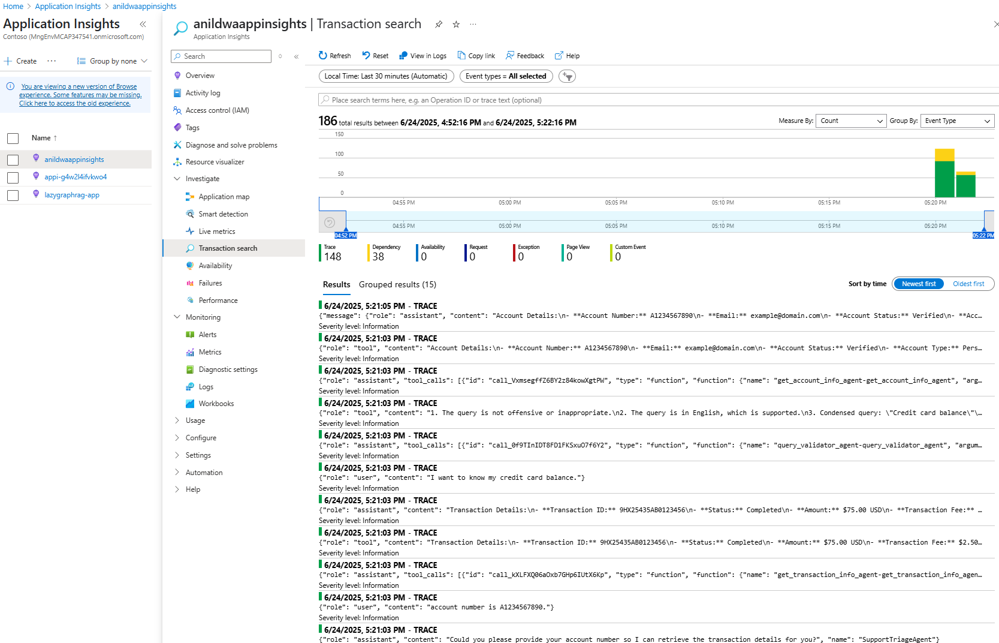

# AGENTIC ARCHITECTURE · Semantic Kernel Agent Framework

A reference implementation of a multi-agent chat system built with **[Microsoft Semantic Kernel](https://github.com/microsoft/semantic-kernel)**, FastAPI, and Azure AI services.

| Capability | Status |
|------------|--------|
| Agent-to-agent architecture | ✔️ Implemented |
| Entra ID (MSAL) authentication | ✔️ Implemented |
| Streaming responses | ✔️ Implemented |
| Stored completions  | ⚠️ Implemented but currently disabled (under investigation) |
| Chat history persistence | ✔️ Implemented |
| Observability hooks (OpenTelemetry) | ✔️ Implemented |
| End-to-end latency metrics | ✔️ Implemented |

---

## Table of Contents
1. [Architecture overview](#architecture-overview)
2. [Prerequisites](#prerequisites)
3. [Environment variables (`.env`)](#environment-variables)
4. [Local setup](#local-setup-linux--macos)  
   4.1&nbsp;[Linux / macOS](#local-setup-linux--macos)  
   4.2&nbsp;[Windows (PowerShell or CMD)](#local-setup-windows)
5. [Running the API server](#running-the-api-server)
6. [Quick tests with `curl`](#quick-tests-with-curl)
7. [Observability & response-time tracking](#observability--response-time-tracking)
8. [Troubleshooting](#troubleshooting)

---

## Architecture overview

```text
┌───────────────────────────┐
│  FastAPI + Semantic Kernel│
│  (multi-agent router)     │
└─────────────┬─────────────┘
              │
      ┌───────▼────────┐
      │  Agent Plugins │──╮
      │ (skills/tools) │  │
      └───────┬────────┘  │
              │           │
   ┌──────────▼───────────▼───────────┐
   │   Azure OpenAI (Completions)     │
   │   Azure AI Search + Foundry      │
   └──────────────────────────────────┘


```
---


## Prerequisites

### 1. Azure resources & RBAC

| Azure service | Minimum role required |Notes|
|---------------|-----------------------|-----|
| Azure AI Search | **Search Service Contributor**, **Search Index Data Contributor** | The index needs to be created and populated with vector embedding and search content |
| Azure AI Foundry | **Azure AI User** | Azure AI Foundry Resource needs to be created |
| Azure OpenAI | **Cognitive Services OpenAI User** | Azure OpenAI latest model deployed|


### 2. Local tooling

* Python ≥ 3.10 (tested on 3.12)  
* Git  
* `curl` (for quick tests)  
* (Optional) Docker Desktop if you prefer containerized runs

---

## Environment variables

1. **Copy** `.env.example` to `.env`:

    ```bash
    cp .env.example .env
    ```

2. Fill in your values:

    ```
    ── Azure OpenAI ───────────────────────────
    AZURE_OPENAI_ENDPOINT=https://<your-openai>.openai.azure.com/
    AZURE_OPENAI_CHAT_DEPLOYMENT_NAME=gpt-4o
    AZURE_OPENAI_TEXT_DEPLOYMENT_NAME=gpt-4o
    AZURE_OPENAI_EMBEDDING_DEPLOYMENT_NAME=text-embedding-ada-002
    AZURE_OPENAI_API_VERSION=2025-02-01-preview
    AZURE_OPENAI_API_KEY=<only if using key auth>

    ── Azure AI Search ───────────────────────
    AZURE_SEARCH_SERVICE_ENDPOINT=https://<your-search>.search.windows.net
    AZURE_SEARCH_INDEX=paypal_cs_index

    ── Optional telemetry ──────────
    AZURE_APP_INSIGHTS_CONNECTION_STRING=<your-connection-string>
    ```

    Security reminder – add .env to .gitignore so secrets are never committed.


3. Local setup

    #### Local setup (Linux / macOS)
    ```bash
    # 1) Clone repository
    git clone https://github.com/<org>/<repo>.git
    cd <repo>

    # 2) Create & activate virtual environment
    python -m venv .venv
    source .venv/bin/activate

    # 3) Install dependencies
    pip install -r requirements.txt
    ```

    #### Local setup Windows

    ```powershell
    :: 1) Clone
    git clone https://github.com/<org>/<repo>.git
    cd <repo>

    :: 2) Create virtual environment
    python -m venv .venv

    :: 3) Activate (PowerShell)
    .\.venv\Scripts\Activate.ps1
    :: or CMD
    :: .\.venv\Scripts\activate.bat

    :: 4) Install dependencies
    pip install -r requirements.txt
    ```

5. Az login

   Make sure you are logged in to Azure CLI with the correct account that has access to the resources:

   ```bash
   az login
    ```

    >Note: If you are using a service principal, configure Service Principal authentication by setting the following environment variables. Then change authentication method in `paypal_agent_implementation.py` to `AzureCliCredential` or `DefaultAzureCredential`.
    
    ```bash
    export AZURE_CLIENT_ID=<your-client-id>
    export AZURE_TENANT_ID=<your-tenant-id>
    export AZURE_CLIENT_SECRET=<your-client-secret>
   ```

    ```powershell
    $env:AZURE_CLIENT_ID="<your-client-id>"
    $env:AZURE_TENANT_ID="<your-tenant-id>"
    $env:AZURE_CLIENT_SECRET="<your-client-secret>"
    ```


4. Running the API server

    ```bash
    uvicorn fast_api:app --reload --host 0.0.0.0 --port 8000
    ```

5. Quick tests with `curl`

    Health Check

    ```bash
    curl -N http://localhost:8000/status/items/1
    ```


6. Multi-agent chat session

    WSL
    ```bash
    session_id=$(uuidgen)

    # Start a new session
    curl -sS -N \
    -H "Content-Type: application/json" \
    -d '{"user_message":"I want to know my credit card balance.","conversation_id":"'"$session_id"'"}' \
    -w '\n-- elapsed: %{time_total}s --\n' \
    http://172.27.0.1:8000/multi_agent_chat/

    # Follow-up messages in the same session
    curl -sS -N \
    -H "Content-Type: application/json" \
    -d '{"user_message":"account number is A1234567890.","conversation_id":"'"$session_id"'"}' \
    -w '\n-- elapsed: %{time_total}s --\n' \
    http://172.27.0.1:8000/multi_agent_chat/

    # Continue the conversation with RAG agent
    curl -sS -N \
    -H "Content-Type: application/json" \
    -d '{"user_message":"how to open dispute PayPal Account?","conversation_id":"'"$session_id"'"}' \
    -w '\n-- elapsed: %{time_total}s --\n' \
    http://172.27.0.1:8000/multi_agent_chat/


    # Different follow-up messages in the same session
    curl -sS -N \
    -H "Content-Type: application/json" \
    -d '{"user_message":"last transaction","conversation_id":"'"$session_id"'"}' \
    -w '\n-- elapsed: %{time_total}s --\n' \
    http://172.27.0.1:8000/multi_agent_chat/
    
    # Unsupported language test
    curl -sS -N \
    -H "Content-Type: application/json" \
    -d '{"user_message":"Was ist meine letzte Transaktion?","conversation_id":"'"$session_id"'"}' \
    -w '\n-- elapsed: %{time_total}s --\n' \
    http://172.27.0.1:8000/multi_agent_chat/
    ```
    
    Linux / macOS

    ```bash
    session_id=$(uuidgen)

    # Start a new session
    curl -sS -N \
    -H "Content-Type: application/json" \
    -d '{"user_message":"I want to know my credit card balance.","conversation_id":"'"$session_id"'"}' \
    -w '\n-- elapsed: %{time_total}s --\n' \
    http://localhost:8000/multi_agent_chat/

    # Follow-up messages in the same session
    curl -sS -N \
    -H "Content-Type: application/json" \
    -d '{"user_message":"account number is A1234567890.","conversation_id":"'"$session_id"'"}' \
    -w '\n-- elapsed: %{time_total}s --\n' \
    http://localhost:8000/multi_agent_chat/

    # Continue the conversation with RAG agent
    curl -sS -N \
    -H "Content-Type: application/json" \
    -d '{"user_message":"how to open dispute PayPal Account?","conversation_id":"'"$session_id"'"}' \
    -w '\n-- elapsed: %{time_total}s --\n' \
    http://localhost:8000/multi_agent_chat/


    # Different follow-up messages in the same session
    curl -sS -N \
    -H "Content-Type: application/json" \
    -d '{"user_message":"last transaction","conversation_id":"'"$session_id"'"}' \
    -w '\n-- elapsed: %{time_total}s --\n' \
    http://localhost:8000/multi_agent_chat/

    # Unsupported language test
    curl -sS -N \
    -H "Content-Type: application/json" \
    -d '{"user_message":"Was ist meine letzte Transaktion?","conversation_id":"'"$session_id"'"}' \
    -w '\n-- elapsed: %{time_total}s --\n' \
    http://localhost:8000/multi_agent_chat/


    ```
## Observability & response-time tracking

This implementation includes OpenTelemetry hooks for observability and response time tracking. You can monitor the performance of the API endpoints and agent interactions in Azure Application Insights or any other OpenTelemetry-compatible backend.

App Insights example



